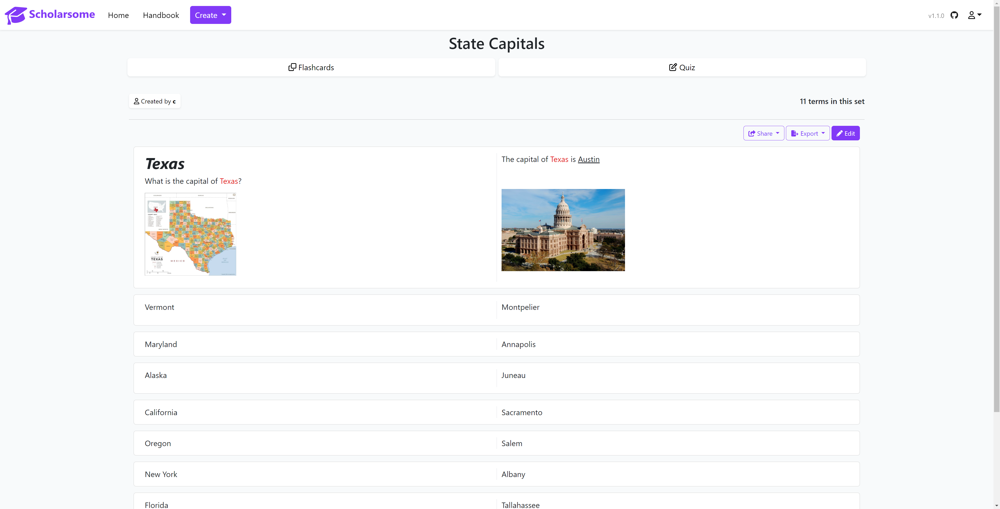

## 

*An open source system for flashcard studying.*

*Inspired by the larger sites that are now charging for core functionality, Scholarsome intends to be a drop-in replacement for any study workflow.*

https://scholarsome.com

## About

Scholarsome <a href="http://ipa-reader.xyz/?text=%CB%88sk%C3%A4l%C9%99rs(%C9%99)m%2F">(pronounced ˈskälərs(ə)m/)</a> is a web-based and open source studying system. Through the use of flashcards, among other core features, users can practice memorization of terms and definitions, along with keeping their data secure locally.

While other services have begun to paywall core functionalities, Scholarsome intends to offer an equal alternative that does not compromise on features.

You can read more about our design philosophy <a href="https://github.com/hwgilbert16/scholarsome#design-philosophy">here.</a>

## Features

- Create your own study sets 🏗️
- Share your sets with other users 🤝
- Import sets from Anki, Quizlet, and CSV files 🔼
- Export sets to Anki, Quizlet, and CSV files 🔽
- Study flashcards in multiple learning modes, mimicking real-world flashcards 📖
- Create quizzes using fill-in-the-blank, true/false, and multiple choice questions ✏️
- Edit your sets 🛠️
- Change set visibility 🔓

## Features coming soon...

- Interactive study games
- Spaced repetition system implementation
- Persistence of quiz results
- Editing permission sharing with other users
- Improved profile page
- User-accessible API

## Usage

Scholarsome is accessible at https://scholarsome.com for individuals who are not interested in hosting it themselves. It is free and runs the same as the most recently released version.

However, the service can be hosted yourself on any system. For those wishing to self-host Scholarsome, documentation for installation can be found <a href="https://scholarsome.com/handbook/installation/prerequisites">here.</a>

## Development

For development purposes, Scholarsome is required to be installed outside the standard container-based system that is used for production installs. Documentation for development can be found <a href="https://scholarsome.com/handbook/development/development-guide">here.</a>

While we use many technologies, some of our most prominent are:

- <a href="https://nestjs.com/">NestJS</a>
- <a href="https://angular.io/">Angular</a>
- <a href="https://www.prisma.io/">Prisma</a>
- <a href="https://nx.dev/">Nx</a>

## Contributing

Scholarsome is an open source project. We believe in a transparent development process and are appreciative of any contributions to the project. Whether it's proposing new features, helping us fix bugs, or improving the documentation - we would love to have your help. Please refer to our <a href="https://github.com/hwgilbert16/scholarsome/blob/develop/CODE_OF_CONDUCT.md">code of conduct</a> to ensure you follow the project's rules.

- **Bug reports.** If you run into an issue using Scholarsome, please <a href="https://github.com/hwgilbert16/scholarsome/issues/new">create a bug report</a>. Make sure you attach the `bug` label to your issue.
- **Feature requests.** We'd love to hear your ideas for future features. Please <a href="https://github.com/hwgilbert16/scholarsome/issues/new">create an issue</a> and attach the `feature request` label to propose a new feature.

## Contributors

## Design Philosophy

Many existing flashcard systems exist that offer countless features - Anki, SuperMemo, etc. However, we recognize that many of these tools can be daunting to new users, or are bloated with features that can be seen as overwhelming. This encourages new flashcard users to stick to simpler tools, causing them to lose out on more advanced functionality. Additionally, not all of these tools are open source.

Scholarsome will bridge this gap between ease of use and functionality in multiple ways.

One way is by offering a familiar web-based interface. There is no syncing between multiple devices to worry about, as data is stored, accessed, and edited from a central server. The process of syncing and having to think about where data is stored can be a confusing topic. Having the place where flashcards are edited be the same place they are stored simplifies this process.

We're also selective about the order in which features are being added. Instead of using a scattershot method, we're working our way up from the simplest features that are the most commonly utilized to the most complex so that they can build upon each other. We write easy to understand guides that are intended to be understood from first glance by the layman. From the ground up, Scholarsome has been designed to have powerful learning tools, but still be understandable by anybody.

It's important to note that Scholarsome is far from complete. We're firm believers of shipping fast and early to gain feedback from users. While some features may be absent at the moment, we love having early users that can ensure we have a stable foundation through valuable feedback.

## Contact

For formal inquiries, you can contact us via support@scholarsome.com

Otherwise, we recommend joining our <a href="https://discord.gg/hRgVvc5MKf">Discord server.</a> Support can be asked here, along with keeping up-to-date with future versions and upcoming features.
